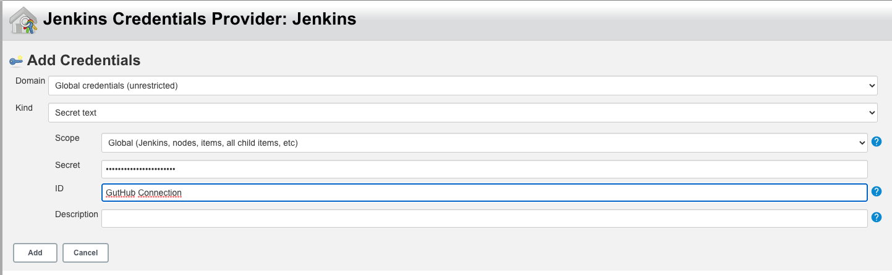
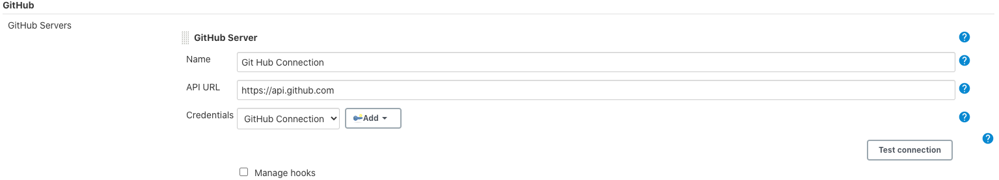

# Run Jenkins

java -jar jenkins.war --httpPort=9090

## Run Agent

```bash
java -jar ~/.jenkins/agent.jar -jnlpUrl http://localhost:9090/computer/agent1/slave-agent.jnlp -secret fc38c48da84dc68b70133e0b42963338d7c900238d22e034fbc72465f7a1fef2 -workDir "/tmp/jenkins-agent1"
```

## SMTP local Server

```bash
docker run --restart unless-stopped --name mailhog -p 1025:1025 -p 8025:8025 -d mailhog/mailhog
```

## Functions

```groovy
def notify(status){
    emailext (
      to: "you@gmail.com",
      subject: "${status}: Job '${env.JOB_NAME} [${env.BUILD_NUMBER}]'",
      body: """<p>${status}: Job '${env.JOB_NAME} [${env.BUILD_NUMBER}]':</p>
        <p>Check console output at <a href='${env.BUILD_URL}'>${env.JOB_NAME} [${env.BUILD_NUMBER}]</a></p>""",
    )
}
```

## app

[https://github.com/allanweber/miro-assessment](https://github.com/allanweber/miro-assessment)

### Generate a new personal access token

Called : **jenkins-new-token**

Mark:

* repo
* admin:repo_hook

## Create a new GitHub Server

### Create a new Credential

Use the new Token



Create the server using the new credential



## Trivy

Container Security

### Install

[https://github.com/aquasecurity/trivy#installation](https://github.com/aquasecurity/trivy#installation)

```bash
brew install aquasecurity/trivy/trivy
...
trivy -version
```

* clear vulnerabilities database

`trivy -c`

* Run against some image

`trivy image-name`

## Groovy

`brew install groovy`

`groovyconsole`

### Sample Groovy Codes in Jenkins

#### Run a Job

```groovy
import jenkins.model.Jenkins;

def svr = Jenkins.instance;

def job = svr.getJob("TEST Groovy");

def sched = job.scheduleBuild2(0)

sched.get();
```

#### Run with Parameter

* Add a new string parameter (called target)

```groovy
import jenkins.model.Jenkins;

def target = build.buildVariableResolver.resolve("target")

def svr = Jenkins.instance;

def job = svr.getJob(target);

def sched = job.scheduleBuild2(0)

sched.get();
```


## Sample of nice pipeline

```groovy
String  committer, envType, version, image
String imageBaseName = 'allanweber/miro-widgets'
String prd = 'prd'
String master = 'master'
pipeline {
    agent any

    stages {
        stage ('Checking') {
            steps {
                echo 'Checking Branch Build: ' + env.BRANCH_NAME
                checkout scm
                script {
                    committer = sh(returnStdout: true, script: 'git show -s --pretty=%an').trim()
                }
                echo 'committer -> ' + committer

                script {
                    version = sh(returnStdout: true,
                    script: 'mvn help:evaluate -Dexpression=project.version -q -DforceStdout')
                }
                script {
                    if (env.BRANCH_NAME == master) {
                        envType = prd
                        image = "${imageBaseName}:${version}"
                    }
                    else {
                        envType = 'dev'
                        image = "${imageBaseName}:${version}-${envType}-${env.BUILD_ID}"
                    }
                }
                echo "Building for ${envType} environment"
                echo 'project version: ' + version
                echo 'image name: ' + image
            }
        }
        stage('Test') {
            steps {
                sh 'mvn clean verify'
                step([$class: 'JUnitResultArchiver', testResults: 'target/surefire-reports/TEST-*.xml'])
            }
        }
        stage('Sonar') {
            when {
                not {
                    branch master
                }
            }
            steps {
                echo 'run sonarQube in future'
            }
        }
        stage('Build Image') {
            steps {
                script {
                    sh "docker build --build-arg ENV_ARG=${envType} -t ${image} ."
                }
            }
        }
        stage('Docker Login') {
            steps {
                script {
                    echo "${env.DOCKER_TOKEN} | docker login -u ${env.DOCKER_USER} --password-stdin"
                }
            }
        }
        stage('Push Images') {
            parallel {
                stage('Push Current Image') {
                    steps {
                        script {
                            pushImage(image)
                            removeImage(image)
                        }
                    }
                }
                stage ('Push Latest Image') {
                    when {
                        branch master
                    }
                    steps {
                        script {
                            String latestImage = "${imageBaseName}:latest"
                            sh "docker tag ${image} ${latestImage}"
                            pushImage(latestImage)
                            removeImage(latestImage)
                        }
                    }
                }
            }
        }
    }
}

def pushImage(imageName) {
    sh "docker push ${imageName}"
}

def removeImage(imageName) {
    sh "docker rmi ${imageName}"
}
```